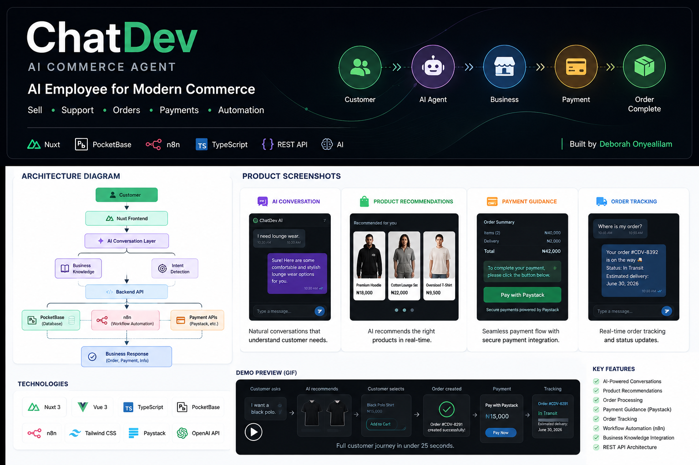
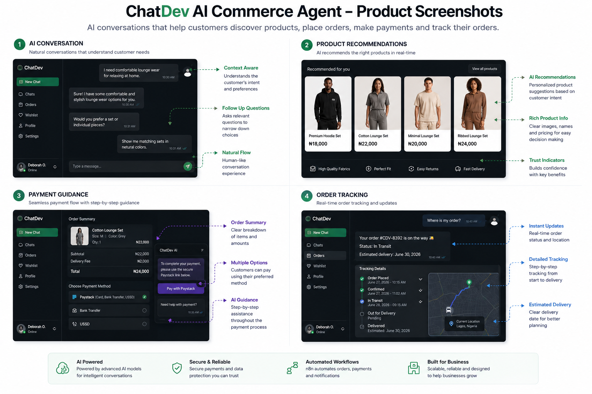
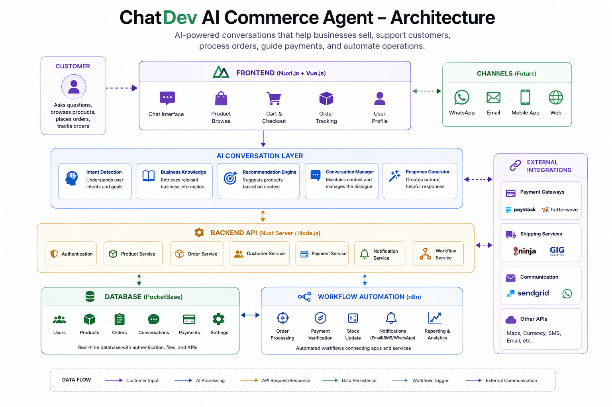

# ChatDev AI Commerce Agent

> **An AI employee that helps businesses sell products, support customers, process orders, guide payments, and automate operations—24/7.**

  

---

## Product Demo

Watch ChatDev automate:

- Customer enquiries
- Product recommendations
- Order processing
- Payment guidance
- Order tracking

Watch Chatdev in action: https://youtu.be/p9VUHjJlMRE

---

## The Problem

Small businesses rarely lose customers because they have bad products.

They lose them because they can't respond fast enough.

A customer sends a message while the owner is busy.

Another wants to compare products.

Someone else needs payment instructions.

Another customer is waiting for an order update.

By the time the business owner replies, the customer has already moved on.

## The Solution

ChatDev acts as an AI commerce employee.

Instead of functioning as a simple chatbot, it understands the business, answers customer questions, recommends products, receives orders, guides customers through payment, and helps customers track their purchases—all through natural conversation.

The goal is simple:

* Respond instantly.
* Reduce repetitive work.
* Improve customer experience.
* Help businesses sell more.

---

# Product Walkthrough

  

### AI Conversation

* Understands customer intent
* Maintains conversational context
* Answers business questions naturally

### Product Recommendations

* Displays products with images
* Shows prices and descriptions
* Recommends relevant products

### Payment Guidance

* Guides customers through payment
* Integrates payment workflows
* Confirms successful transactions

### Order Tracking

* Retrieves customer orders
* Displays delivery status
* Keeps customers informed

---

# System Architecture

  

ChatDev combines conversational AI, business knowledge, workflow automation, and backend services into a single commerce platform.

Customer requests flow through the frontend into the AI conversation layer, which retrieves business knowledge, communicates with backend APIs, triggers workflow automation, and returns contextual responses in real time.

---

# Key Features

✅ AI-powered customer conversations

✅ Product recommendations

✅ Business knowledge retrieval

✅ Order processing

✅ Payment guidance

✅ Order tracking

✅ Workflow automation with n8n

✅ REST API integrations

✅ PocketBase backend

---

# Technology Stack

### Frontend

* Nuxt 3
* Vue 3
* TypeScript
* Tailwind CSS

### Backend

* PocketBase
* REST APIs
* Node.js

### AI & Automation

* n8n
* Large Language Models (LLMs)
* Prompt Engineering
* Business Knowledge Retrieval

---

# Development Journey

ChatDev wasn't built in a weekend.

The project has evolved through continuous user testing, product validation, and iterative improvements.

Recent improvements include:

* Improved multi-product rendering
* Better shopping experience
* Refined AI conversations
* Enhanced payment workflow
* Cleaner product recommendations
* UI improvements based on real user feedback

Every improvement is driven by real customer behaviour rather than assumptions.

---

# Documentation

Project documentation is available in the `/docs` directory.

* System Architecture
* API Overview
* Roadmap
* Changelog

---

# Future Improvements

* WhatsApp integration
* Voice AI
* CRM integrations
* RAG implementation
* Vector database support
* Multi-business support
* Analytics dashboard

---

# Author

**Deborah Onyealilam**

Full-Stack Developer • AI Agent Developer • Product Validation & Scope Strategist

Building AI employees that help businesses sell, support customers, and automate operations.

If you found this project interesting, feel free to connect or contribute.
